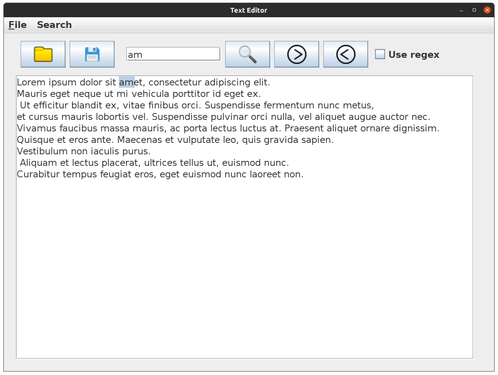
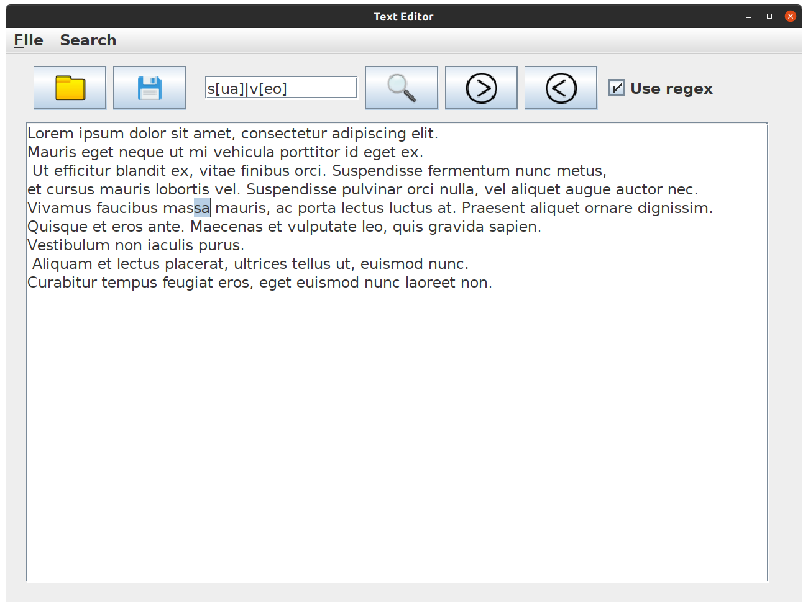
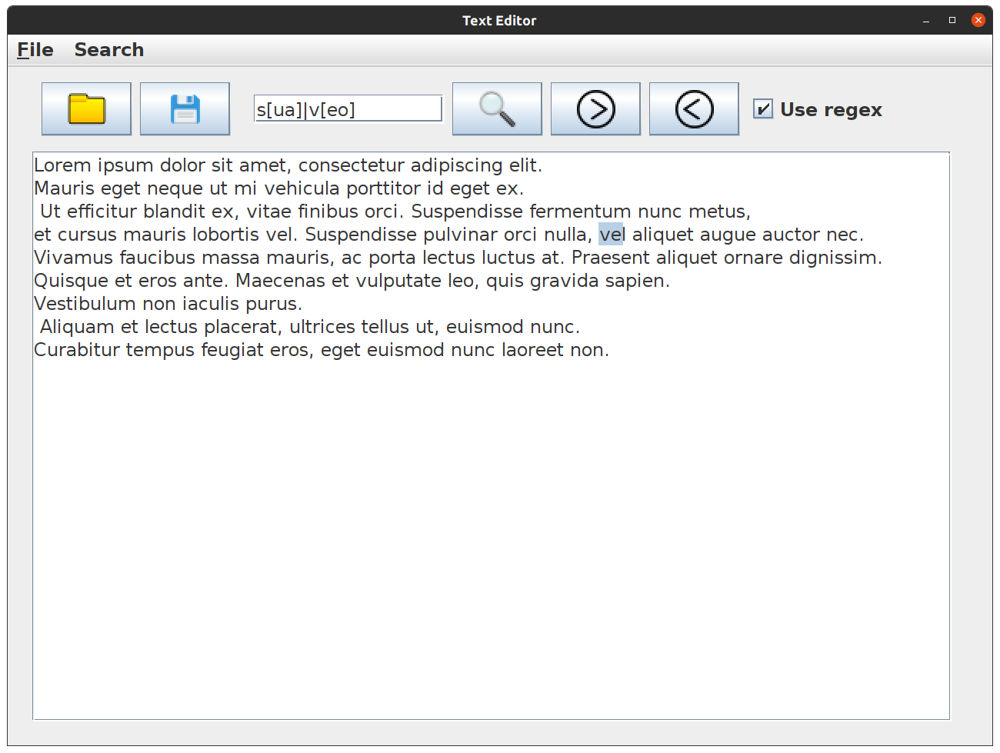

##Text editor
###project from [JetBrains Academy](https://www.jetbrains.com/academy/)
  
  
What I learned:
  * swing(some components)
  * multithreading in swing(a little bit)
  * some useful data structures(but I didn't use them here)

  
  Now let's see my work:
  * main window   
     
*  simple search    
  
     
*  search with regex
  
